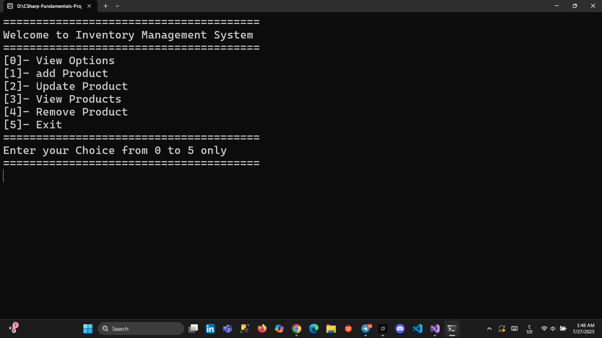

# 🧾 Inventory Management System (Console App - C#)

A basic console-based inventory management system built using **C#** that allows users to manage a list of products (up to 50).  
This project is designed as a simple practice of core C# programming fundamentals.

---

## 📌 Features

- ➕ Add new products (name, quantity, price)  
- 🔄 Update existing product details  
- 📋 View all products with ID, name, quantity, and price  
- ❌ Remove a product by ID  
- 🚪 Exit the program

---

## 💡 Technologies Used

- .NET 8 Console Application  
- 2D string array for storing products  
- Basic `if`, `switch`, and `loop` constructs  
- Input validation using `int.TryParse()`

> ⚙️ This app uses a simple string array to store product data, intentionally avoiding more advanced data structures (like `List<>`) to stay focused on fundamentals.

---

## 🖼️ Sample UI



---

## 🚀 Getting Started

To run the application locally:

```bash
dotnet run
